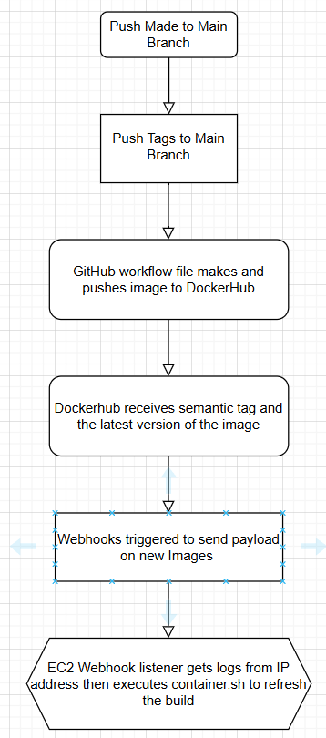

## Part 1:

# 1. Generating tags
 - How to see tags in a git repository: git tag
 - How to generate a tag in a git repository: git tag -a v*.*.*
 - How to push a tag in a git repository to GitHub: git push

# 2. Semantic:
 - Based on the reference, v*.*.* is a safe way for a tag to match and to be pushed to the repository. It will trigger only when the Git tag matching it is pushed. 

Workflow:
	- `name`: what it's for
	- `on: push: tags: -v*.*.*`: on push, it will run semantic version tags like v1.0.0
	- `checkout code`: This will pull the recent and most latest version of your project from GitHub so it has the code to build the Docker image
	- `extract metadata`: This will read version of the tag and prepare the set of tags for the image. It creates the `latest`, `major`, and `major.minor` tags.
	- `set up docker build`: this is when you build the docker image on Github's server.
	- `log in to docker`: now that the image is created, you need somewhere to push it to so we need to log in to docker. this uses the secrets that were saved in the GitHub repo like your username and the generated token to push the image there.
	- `build and push docker`: this is where it finally happens where it will build the image using the prior code and use the tags that were created with multiple versions.

# 3. Testing and validating:
	- To test: run `git tag v1.0.0` then `git push origin v1.0.0`
	- GitHub & DockerHub: In your repo's Actions, it should show the status of your image to be 'SUCCESS' and in Dockerhub, it should show up in your DockerHub repositories.

## Part 2:

# 1. EC2 Instance Details:
- Instance type: Amazon 
- Instance type: t2.medium
- Volume Size: 30 
- Security Configuration: 80 & 9000
- Justification: 
	- `Port 80`: Open for web traffic, specifically for the Angular application
	- `Port 9000`: For testing webhook locally like payloads from GitHub.

# 2. Docker Setup on OS on the EC2 instance:
- `sudo yum update -y`
- `sudo yum install -y docker`
- `sudo service docker start`
- `sudo usermod -a -G docker ec2-user`
- To verify: `docker --version`
- To test container ability: `docker run hello-world`

# 3. Testing on EC2 Instance:
- `docker pull (username)/(repository-name)`
- To run: `docker run -d -p 80:80 (username)/(repository-name)`

# 4. Webhooks:
- To install: `sudo yum install -y webhook`
- To verify: `webhooks --version`
- It lets DockerHub send a message to our EC2 when an event happens like pushing a new Docker image. It triggers the bash script to run and refresh with a new image. 
- `sudo vim /usr/lib/systemd/system/webhook.service`: This is to edit the service file. 
- `sudo systemctl daemon-reload`: Whenever I had changes, this commands helps refresh it.
- `sudo systemctl enable webhook.service'
- `sudo systemctl start webhook.service`
- `sudo systemctl status webhook.service`
- `http://(IP address):9000/`: Your response should be a white screen and an `OK`

## Part 3:
- The Goal of this project is to use Docker, GitHub, and an EC2 Instance to ensure the system is automatically updated with the latest version of the application without any manual intervention when a developer commits and pushes new code.
- I had a lot of trouble with making the scripts since there was always something wrong with either the directory locations or a wrong command. I'm still a little unsure with DockerHub since it seems to not really be working with my code but I will explore alternatives later on.
- Diagram:

  
# Resources:
- [Docker](https://docs.aws.amazon.com/serverless-application-model/latest/developerguide/install-docker.html)
- [Syntax Guide](https://docs.github.com/en/actions/writing-workflows/workflow-syntax-for-github-actions)
- [DevGenius](https://blog.devgenius.io/build-your-first-ci-cd-pipeline-using-docker-github-actions-and-webhooks-while-creating-your-own-da783110e151)
- [Webhook](https://github.com/adnanh/webhook)
- [Webhook 2](https://kubernetes.io/docs/reference/access-authn-authz/webhook/)
- [Webhooks 3](https://docs.github.com/en/webhooks/using-webhooks/creating-webhooks)
- [Payload Json](https://stackoverflow.com/questions/63803136/how-to-get-my-own-github-events-payload-json-for-testing-github-actions-locally)
- [Validation](https://docs.github.com/en/webhooks/using-webhooks/validating-webhook-deliveries)
- 

